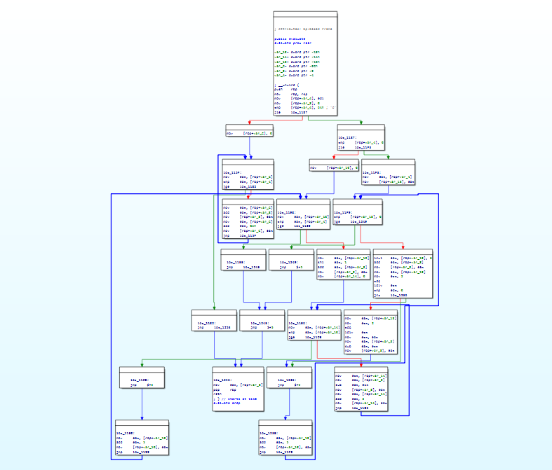
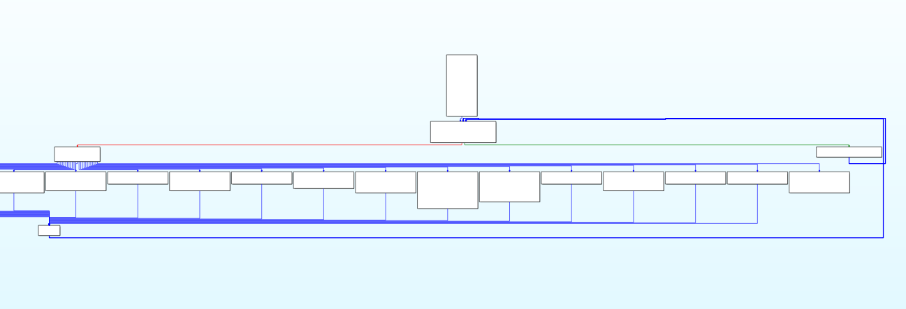

# llvm-obfuscator

This project provides basic implementation of various obfuscation techniques in order to make reverse engineering and static analysis more difficult.

The passes can be used independently or in combination, in different order, as well as multiple times in a row on the same target to achieve various levels of obfuscation. Have fun tweaking :]

*This project is built under **LLVM 17** and follows the [New Pass Manager](https://llvm.org/docs/NewPassManager.html) infrastructure.*

## Control Flow Graph

### Snippet

```c
int evaluate(int x) {
    int result = 0;
    if (x > 100) {
        for (int i = 0; i < x; i += 10) {
            result += i;
        }
    } else if (x > 0) {
        for (int i = 0; i < x; i += 5) {
            result += i * 2;
            for (int j = 0; j < i; j += 2) {
                result -= j;
            }
        }
    } else {
        for (int i = x; i < 0; i += 5) {
            result += i * 3;
            if (i % 2 == 0) {
                result -= i / 2;    
            }
        }
    }
    return result;
}
```

### Without obfuscation


### With CFF obfuscation


---

## Passes

- Bogus Control Flow ("bcf")
    - Uses [Collatz conjecture](https://en.wikipedia.org/wiki/Collatz_conjecture) as Opaque predicate | Cao Y, Zhou Z, Zhuang Y. Advancing Code Obfuscation: Novel Opaque Predicate Techniques to Counter Dynamic Symbolic Execution. Computers, Materials & Continua, 2025, 84(1): 1545-1565. https://doi.org/10.32604/cmc.2025.062743
- Control Flow Flattening ("cff")
- Instruction Substitution ("is")
    - `add` instructions | Uses Mixed Boolean-Arithmetic

## Setup

### Build

```bash
$ mkdir build
$ cd build
$ cmake ..

$ cd ..
$ make -C build
```

### Usage example

```bash
# be careful with optimization levels (e.g -O0)
$ clang-17 -S -emit-llvm -O0 samples/cff.c -o out/out.ll

# use -passes="bcf,cff,is" to use other passes (order matters) | NOTE: this overwrites the original .ll
$ opt-17 -load-pass-plugin=build/LLVMObfuscator.so -passes="cff" out/out.ll -S -o out/out_obfuscated.ll

$ clang-17 out/out_obfuscated.ll -o out/out
```

## TODO

- Implement some of the more obscure transformations used in [Tigress](https://tigress.wtf/)?

---

## License

This project is licensed under the MIT License. See [LICENSE](LICENSE) for details.

---

*For more information, see the [LLVM documentation](https://llvm.org/docs/).*
